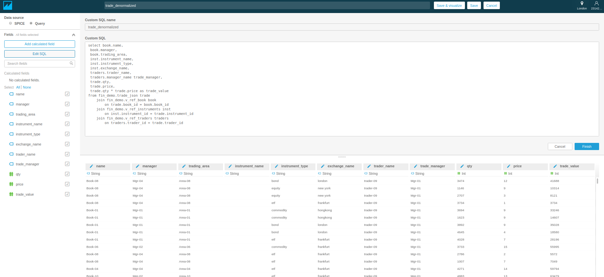
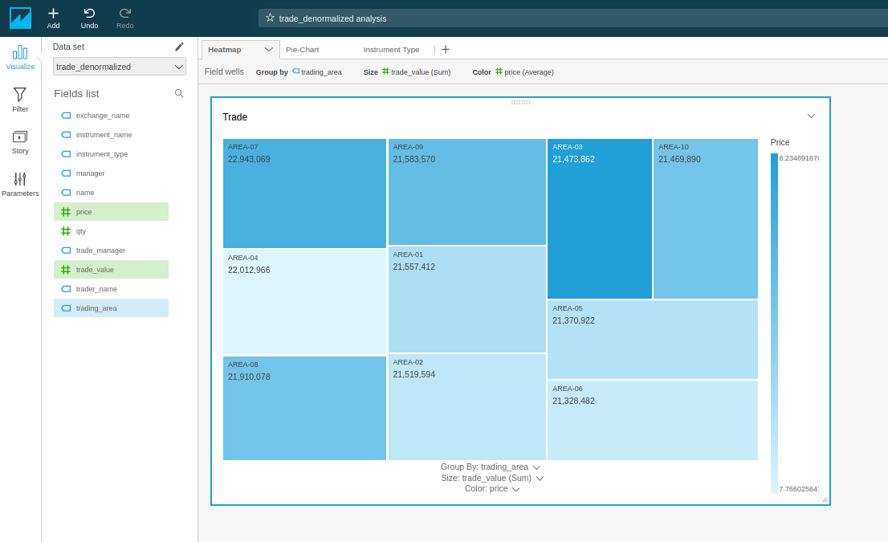
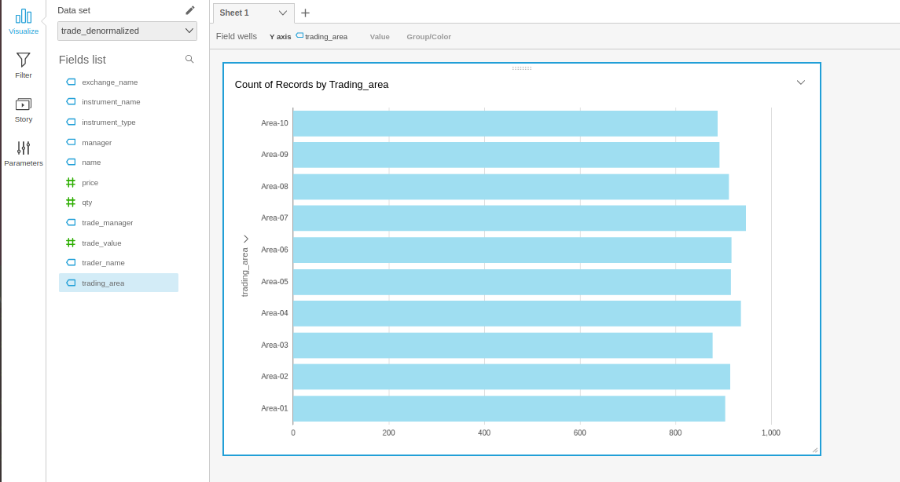

# Athena and Quicksight

Amazon Athena is an interactive query service to analyze data in Amazon S3 using standard SQL. Athena is serverless and is out-of-the-box integrated with AWS Glue Data Catalog. Amazon Athena uses Presto with full standard SQL support and works with a variety of standard data formats, including CSV, JSON, ORC, Avro, and Parquet. Presto is an open source distributed SQL query engine for running interactive analytic queries against data sources of all sizes ranging from gigabytes to petabytes.

Amazon QuickSight is a fast, cloud-powered business intelligence service that makes it easy to deliver insights to everyone in your organization.

As a fully managed service, QuickSight allows to easily create and publish interactive dashboards accessed from any device, and embedded into applications, portals, and websites.

## Objective
* Create a table against price and transaction offloaded from kinsesis streams and stored in s3
* Create a reference table for books, traders and instruments. 
* All of the reference data is stored in the same s3 bucket, hence three views are created to filter in only the appropirate reference data
* Create datasets within Quicksight
* Build a dashboard

## Setup

Create a user `athena_admin` using Terraform. Obtain the corresponding ssh_keys and store it in the `.aws/credentials` file

### Create user
[Code File](/terraform/athena/main.tf)

Terraform code for creating user

```
# Declare variables
variable "aws_iam_profile"  {}
variable "credentials_file" {}
variable "region" {}

# Specify the cloud provider
provider "aws"{
   alias = "iam"
   region = "eu-west-2"
   shared_credentials_file = var.credentials_file
   profile = var.aws_iam_profile
}

#Create user
resource "aws_iam_user" "athena_admin" {
  name = "athena_admin"
  provider = "aws.iam"
}

# SSH Keys for the user
resource "aws_iam_access_key" "athena_access_key" {
  user = "${aws_iam_user.athena_admin.name}"
  provider = "aws.iam"
}

# Policy attached to the user
resource "aws_iam_user_policy" "admin_policy" {
  name = "admin_policy"
  user = "${aws_iam_user.athena_admin.name}"
    provider = "aws.iam"
  policy = <<EOF
{   "Version": "2012-10-17",
    "Statement": [
        {
            "Effect": "Allow",
            "Action": "athena:*",
            "Resource": "*"
        },
        {
            "Effect": "Allow",
            "Action": "s3:*",
            "Resource": "*"
        },
        {
            "Effect": "Allow",
            "Action": "glue:*",
            "Resource": "*"
        }
    ]
}
EOF
}
```
Once `terraform apply` is executed the ssh keys are available as plain text in `terraform.tfstate`. Use the keys to populate `~/.aws/credentials file`. Upate the `~/.aws/config` file as well as shown below

```
# ~/.aws/credentials
[athena-profile]
aws_access_key_id = <key_id from terraform.tfstate>
aws_secret_access_key = <secret from terraform.tfstate>

# ~/aws/config
[profile athena-profile]
region = eu-west-2
output = json
```

## Table Structures

In this Athena demonstrator, we will create the listed table structure

| Table Name | Source | Fields | Source  Storage Format |
|---------------|------------------------------------------|-----------------------------------------------------------------------------------------------------------------------------|------------------------|
| price_json | s3://rsdg-fin-demo-price-eu-west-2 | * instrument_id int <br> * price int <br> * ts string <br> | json |
| trade_json | s3://rsdg-fin-demo-transaction-eu-west-2 | * book_id int <br> * trader_id int <br> * instrument_id int <br> * qty int <br> * price int <br> * ts string <br> | json |
| books | s3://rsdg-fin-demo-reference-eu-west-2 | * ref_type string <br> * book_id int <br> * name string <br> * manager string <br> * trading_area string <br> | csv |
| instruments | s3://rsdg-fin-demo-reference-eu-west-2 | * ref_type string <br> * instrument_id int <br> * instrument_name int <br> *  instrument_type string * exchange_name string | csv |
| traders | s3://rsdg-fin-demo-reference-eu-west-2 | * ref_type string <br> * trader_id int <br> * trader_name string <br> * manager_name string <br> | csv |
| v_books | books | books.* where ref_type = 'books' | table rows |
| v_instruments | instruments | books.* where ref_type = 'instruments' | table rows |
| v_trades | traders | books.* where ref_type = 'traders' | table rows |

## Approach

Previous examples used `Terraform` a [declarative programming model](!https://tylermcginnis.com/imperative-vs-declarative-programming/). In declrative programming model, the end state is specified and the programming model achieves it by making the required changes. The programming model deduces the required path to achieve the end state. 

This section uses imperative programming model, where the programming model is explicitly told the path and the logic to achieve the end state. This section uses [python boto3](!https://realpython.com/python-boto3-aws-s3/) package to build the Athen database and tables. Terraform does not have full support for Athena yet, hence this route.


## Code blocks

[Code File](/python/build_athena.py)
Executing query using boto3 package `boto3.client.start_query_execution` is the heart of this approach.It executes queries against the athena database. Since the queries are executed in AWS progaramatically, the results and errors are stored in `AWS S3 buckets` itself. 

```python
#Create a boto3 session. Pass the profile name used in `create user` sectio above
_session = boto3.Session(profile_name=aws_profile)
    athena_client = _session.client('athena', region_name='eu-west-2')
```

```python
# a wrap-around boto3.client.start_query_execution
# Result configuration specifies a S3 bucket to store the results
def execute_query(athena_client: boto3.client, query: str) -> dict:
    return athena_client.start_query_execution(
        QueryString=query,
        ResultConfiguration={
            "OutputLocation": cfg.S3_OUTPUT_DIR,
            "EncryptionConfiguration": {
                "EncryptionOption": "SSE_S3"
            }
        }
    )

```

The above function is repeatedly exectued to construct the database and the tables

```python
    execute_query(athena_client, queries.create_database(aws_profile))

    execute_query(athena_client, queries.create_table('PRICE_JSON'))
    execute_query(athena_client, queries.create_table('TRADE_JSON'))
    
    execute_query(athena_client, queries.create_table('REF_TRADERS'))
    execute_query(athena_client, queries.create_table('REF_BOOKS'))
    execute_query(athena_client, queries.create_table('REF_INSTRUMENTS'))
    
    execute_query(athena_client, queries.create_table('V_REF_BOOKS'))
    execute_query(athena_client, queries.create_table('V_REF_INSTRUMENTS'))
    execute_query(athena_client, queries.create_table('V_REF_TRADERS'))
```
## Connecting SQlworkbench to Athena

Use [sqlworkbench to connect to Athena](https://aws.amazon.com/blogs/big-data/connect-to-amazon-athena-with-federated-identities-using-temporary-credentials/)

**Note:** Implementing a simpler access mechanism (not using STS and temporary credentials) to one described in the link above
1. Download the Athena jar files as per the above link
2. Use the credentials in **Athena set-up section** above to configure sqlworkebench
3. Use the credentials in sqlworkbench

## Running queries

Some queries that can be run from sqlworkbench
```
# Processing s3 buckets related to trade offloaded from kinesis firehose
select *
from fin_demo.trade_json;

# Processing s3 buckets related to price offloaded from kinesis firehose
select *
from fin_demo.price_json;

# Processing s3 buckets related to ref_books
# Three different file formats are stored in the same bucket
# hence throws errors in rows that do not meet the structure of the table book
select *
from fin_demo.ref_books;

# The views do not throw errors as they are filtered for unique dataset
select *
from fin_demo.v_ref_books;
```

## Quicksight

### Creating Dataset

A data set is created using a joined up query

```
select book.name, 
 book.manager,
 book.trading_area,
 inst.instrument_name,
 inst.instrument_type,
 inst.exchange_name,
 traders.trader_name, 
 traders.manager_name trade_manager,
 trade.qty, 
 trade.price, 
 trade.qty * trade.price as trade_value
from fin_demo.trade_json trade
    join fin_demo.v_ref_book book
        on trade.book_id = book.book_id
    join fin_demo.v_ref_instruments inst
        on inst.instrument_id = trade.instrument_id
    join fin_demo.v_ref_traders traders
        on traders.trader_id = trade.trader_id
```




### Dashboards

*Dashboard examples*





## Related Notebooks
* [Setup](https://github.com/satishrsdg/aws-finance-analytics-demo/blob/master/markdown/setup.md) 